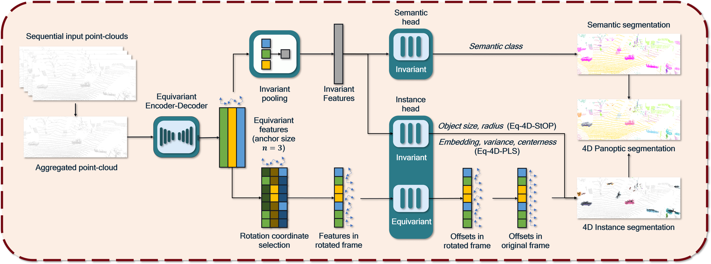
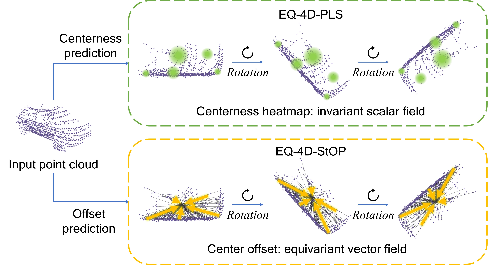
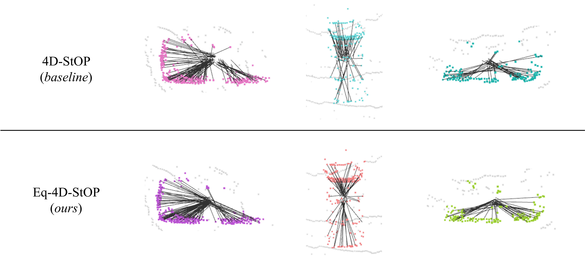
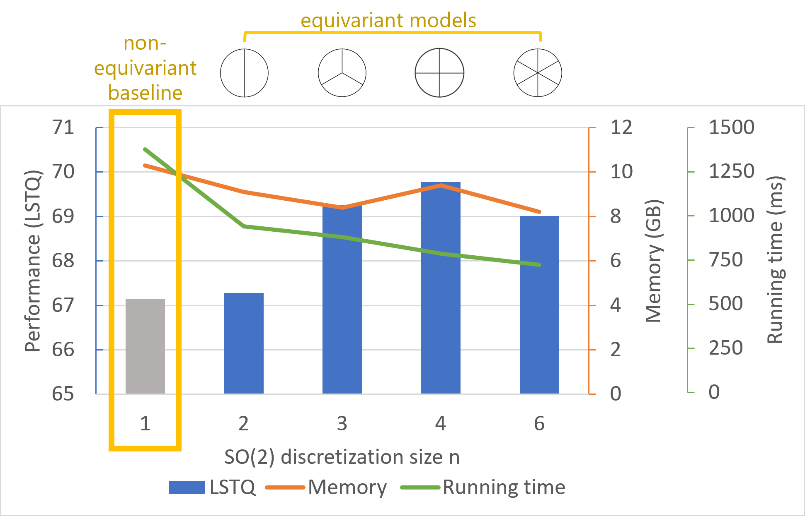

This is the project page for the ICCV 2023 [paper](https://arxiv.org/abs/2303.15651): 

**4D Panoptic Segmentation as Invariant and Equivariant Field Prediction**

Our model ranks **1st** on the SemanticKITTI 4D Panoptic Segmentation public [leaderboard](http://semantic-kitti.org/tasks.html#panseg4d)! 

Two models are presented in our paper: EQ-4D-STOP and EQ-4D-PLS. 

### Code open-sourced!

EQ-4D-StOP: [*this link*](https://github.com/minghanz/EQ-4D-StOP). 

EQ-4D-PLS: coming soon. 

## TL;DR
### Main idea
We view the instance clustering strategies through the lens of *invariant and equivariant field* regression, yielding the two models. 

### Qualitative result
Take EQ-4D-StOP as an example, the regressed offsets from the equivariant model more accurately point to the instance centers.

### Quantitative result
Our equivariant models achieve *higher accuracy* (LSTQ) with *lower memory consumption and running time* compared with the non-equivariant baseline. 

